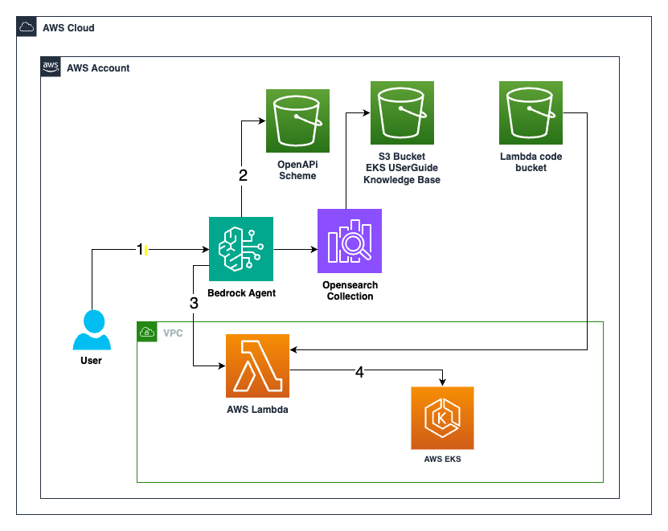

# Using AWS Bedrock Agents to automate creation of access entry controls in EKS by using Bedrock Agents through simple text based prompts

Through this solution, organizations can streamline their EKS cluster administration with simple text based prompts, reduce manual overhead, and improve overall development efficiency.

## Architecture

    

1. User write the prompts to bedrock agents which acts as input for the agent to process and take action.

2. First based on the prompt, agent looks for the correct API it should target from the OpenAPI scheme bucket. If it finds the correct API call the request goes to the Action Group that is Lambda Function. If it does not find any relevant API then agent looks into the knowledge base for contextual response.

3. Agent will find a contextual response to the input provided by the user in case of not finding any API in STEP-2  by using the OpenSearch collection which has done the indexing of the document of data which is provided as knowledge base.

4. Opensearch help agent to find a response.

5. Agent invoke the Lambda Function to perform action based on user input.

6. Lambda does the job for you inside the cluster.

7. Lambda code bucket store the artifact which has the code and logic written for AWS Lambda function.

## Deploy the Solution

- To deploy this solution your AWS account follow this guide - [FIRST_DEPLOY.md](./FIRST_DEPLOY.md)

- If you face any issue while deploying retry the stack using this guide - [RE_DEPLOY.md](./RE_DEPLOY.md)

## Security

See [CONTRIBUTING](CONTRIBUTING.md#security-issue-notifications) for more information.

## License

This library is licensed under the MIT-0 License. See the LICENSE file.
